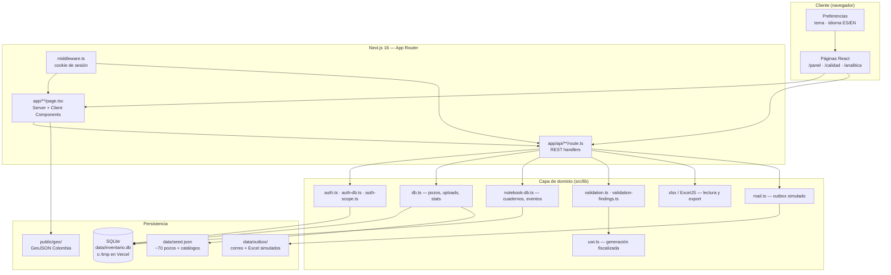
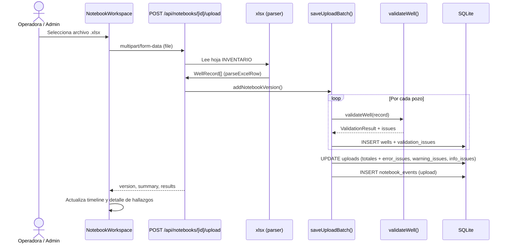
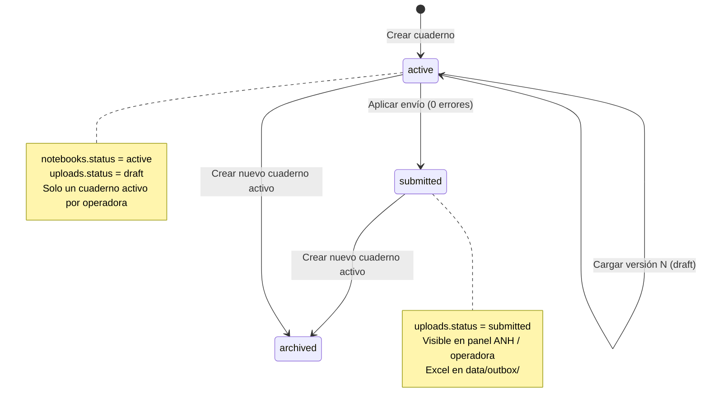
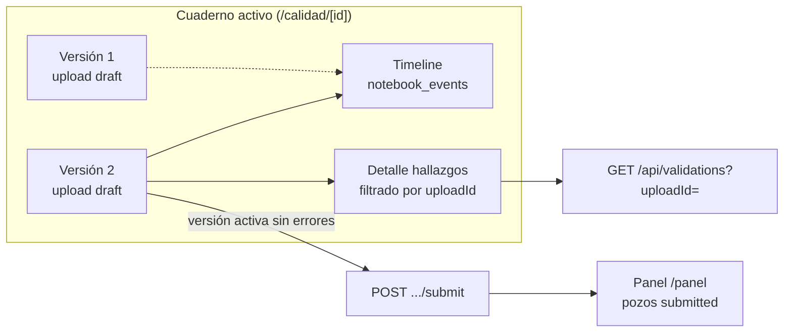
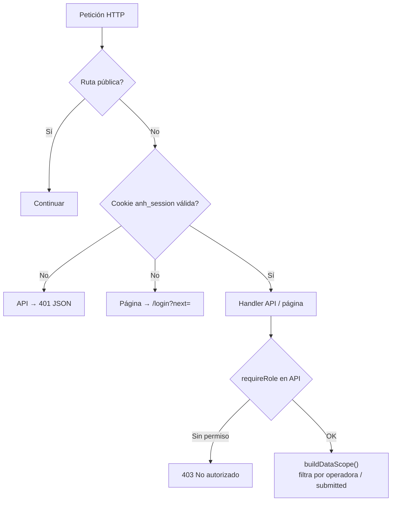
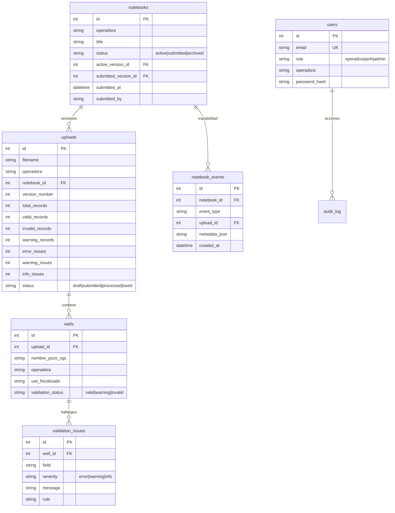
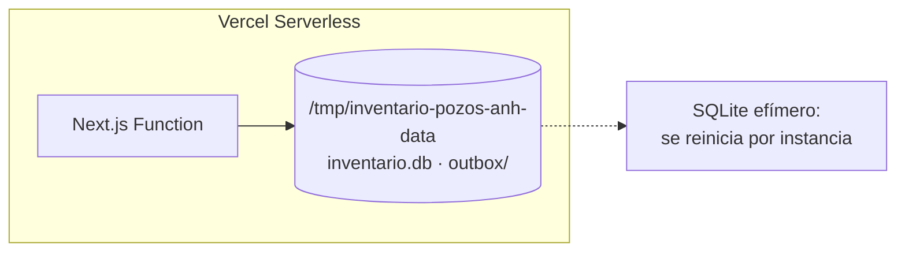

# Inventario de Pozos — ANH (Sistema GOP)

Sistema web de la **Agencia Nacional de Hidrocarburos (ANH)** para la recepción, validación, consolidación y consulta del inventario de pozos reportado por operadoras. Implementa el flujo institucional del **Sistema de Gestión de Operaciones y Producción (GOP)**, con asignación de **UWI fiscalizado** según el instructivo ANH (abril 2026).

**Repositorio:** [github.com/PhDRedondo/Inventario-de-pozos](https://github.com/PhDRedondo/Inventario-de-pozos)

| Capa | Tecnología |
|------|------------|
| Frontend | Next.js 16 (App Router), React 19, Tailwind CSS 4 |
| Backend | API Routes (mismo proceso Node.js) |
| Base de datos | SQLite (`better-sqlite3`) |
| i18n | Español (por defecto) / English |
| Despliegue | Vercel (SQLite efímero en `/tmp`) |

---

## Tabla de contenidos

- [Resumen ejecutivo](#resumen-ejecutivo)
- [Arquitectura del sistema](#arquitectura-del-sistema)
- [Flujo de carga Excel y validación](#flujo-de-carga-excel-y-validación)
- [Cuadernos de inventario (versiones y trazabilidad)](#cuadernos-de-inventario-versiones-y-trazabilidad)
- [Autenticación, roles y rutas](#autenticación-roles-y-rutas)
- [Modelo de datos](#modelo-de-datos)
- [Roles y permisos](#roles-y-permisos)
- [Flujos por rol](#flujos-por-rol)
- [Validación y UWI fiscalizado](#validación-y-uwi-fiscalizado)
- [Conteos: pozos vs hallazgos](#conteos-pozos-vs-hallazgos)
- [Panel y analítica](#panel-y-analítica)
- [Landing pública](#landing-pública)
- [Inicio rápido](#inicio-rápido)
- [Variables de entorno](#variables-de-entorno)
- [Despliegue en Vercel](#despliegue-en-vercel)
- [Estructura del proyecto](#estructura-del-proyecto)
- [API principal](#api-principal)
- [Desarrollo y convenciones](#desarrollo-y-convenciones)
- [Acceso demo](#acceso-demo)
- [Scripts útiles](#scripts-útiles)
- [Guía de puesta en producción ANH](#guía-de-puesta-en-producción-anh)
- [Limitaciones y próximos pasos](#limitaciones-y-próximos-pasos)
- [Licencia y uso](#licencia-y-uso)

---

## Resumen ejecutivo

El sistema cubre el ciclo completo del inventario de pozos:

1. La **operadora** crea un **cuaderno de inventario**, carga versiones del Excel oficial y corrige hallazgos hasta obtener **cero errores** en la versión activa.
2. Al **aplicar el envío a la ANH**, el lote pasa de `draft` a `submitted`, queda visible en el panel institucional y se genera un paquete en `data/outbox/` (simulación de correo a `correspondenciaanh@anh.gov.co`).
3. **Funcionarios ANH** consultan el inventario **ya validado** en el panel y profundizan en **analítica comparativa** (radar, mapas térmicos, nubes de producción).
4. El **administrador** gestiona usuarios y puede operar cuadernos en nombre de cualquier operadora.

Los **40 atributos** del formato Excel están centralizados en `src/lib/attributes.ts` (29 columnas del mapa oficial + columnas especiales + UWI fiscalizado generado).

---

## Arquitectura del sistema

Vista de capas: una sola aplicación Next.js full-stack; no hay microservicios ni cola de mensajes externa.



### Módulos principales

| Módulo | Ubicación | Responsabilidad |
|--------|-----------|-----------------|
| **Autenticación** | `auth.ts`, `auth-db.ts`, `auth-scope.ts` | Sesión por cookie firmada, usuarios, `audit_log`, alcance de datos por rol |
| **Pozos y cargues** | `db.ts` | CRUD de pozos, lotes (`uploads`), informes de validación, filtros del panel |
| **Cuadernos** | `notebook-db.ts` | Ciclo de vida del cuaderno, versiones, timeline de eventos |
| **Validación** | `validation.ts` | Reglas de negocio por pozo; catálogos desde `seed.json` |
| **Hallazgos** | `validation-findings.ts` | Conteo y filtrado de issues (error / warning / info) |
| **UWI** | `uwi.ts` | Generación y validación según instructivo abril 2026 |
| **Analítica** | `analytics.ts`, `analytics-db.ts` | Temas, radar comparativo, entidades |
| **UI cuaderno** | `NotebookInventory.tsx`, `NotebookWorkspace.tsx` | Inventario de cuadernos y workspace con trazabilidad |
| **i18n** | `i18n/messages/es.ts`, `en.ts` | Traducciones; locale en `localStorage` |

---

## Flujo de carga Excel y validación

Cada fila del Excel se valida de forma **determinista**: los conteos no son inventados; provienen de `validateWell()` y se persisten en `validation_issues`.



### Estados de un pozo tras validar

| `validation_status` | Condición |
|---------------------|-----------|
| `invalid` | Al menos un hallazgo con severidad `error` |
| `warning` | Sin errores, pero con advertencias |
| `valid` | Sin errores ni advertencias |

### Severidades de hallazgo

| Severidad | Efecto en el pozo | Bloquea aplicar envío |
|-----------|-------------------|------------------------|
| `error` | Pozos inválidos (`invalid_records`) | Sí — la versión activa debe tener 0 pozos inválidos |
| `warning` | Pozos con advertencias | No |
| `info` | Informativo (p. ej. diferencia UWI SGC vs fiscalizado) | No |

---

## Cuadernos de inventario (versiones y trazabilidad)

Un **cuaderno** agrupa el ejercicio de inventario de una operadora. Cada carga Excel genera una **versión numerada** (`uploads.version_number`) en estado `draft` hasta que se aplica el envío.





### Eventos de trazabilidad (`notebook_events`)

| `event_type` | Cuándo se registra |
|--------------|-------------------|
| `created` | Creación del cuaderno |
| `upload` | Cada carga Excel (metadata con totales y conteos de hallazgos) |
| `submit` | Aplicación del inventario a la ANH |
| `archived` | Archivo al abrir un cuaderno nuevo |

Solo puede haber **un cuaderno activo** por operadora. Al crear uno nuevo, el anterior pasa a **archivado** y permanece en el inventario histórico.

### Cuaderno demo automático

Para la operadora demo (`DEMO_OPERADORA`), `ensureDemoNotebook()` crea en la primera instancia un cuaderno **«Cuaderno demo — inventario de prueba»** con 2 pozos sintéticos que igualmente pasan por `validateWell()`. Las cargas reales del usuario (p. ej. «DEMO base prueba inventario pozos.xlsx») son independientes y generan versiones adicionales.

---

## Autenticación, roles y rutas



### Rutas públicas (sin sesión)

Definidas en `middleware.ts`:

- `/` — landing
- `/login`
- `/api/auth/login`
- `/api/catalogs`
- `/api/public/landing-stats`

Todo lo demás exige cookie de sesión.

### Navegación por rol

Definida en `src/lib/navigation.ts`:

| Rol | Menú lateral |
|-----|--------------|
| **operadora** | Panel · Cuaderno |
| **anh** | Panel · Analítica |
| **admin** | Panel · Cuaderno · Analítica · Usuarios |

### Alcance de datos en el panel

Implementado en `buildScopeClause()` (`db.ts`):

| Rol | Pozos visibles |
|-----|----------------|
| **admin** | Todos |
| **operadora** | Solo su operadora; uploads `submitted` o `seed` (borradores no aparecen en panel) |
| **anh** | Uploads `submitted`, `seed` o `processed`; solo pozos `valid` o `warning` |

### Páginas y redirecciones

| Ruta | Descripción |
|------|-------------|
| `/` | Landing institucional: hero con estadísticas reales, capacidades interactivas, flujo GOP y portales por rol. **Sesión activa:** no redirige a `/panel`; el logo del sidebar vuelve aquí sin cerrar sesión |
| `/login` | Inicio de sesión |
| `/panel` | Dashboard principal (mapa, KPIs, Sankey, tabla) |
| `/calidad` | Inventario de cuadernos |
| `/calidad/[id]` | Workspace: versiones, trazabilidad, hallazgos, cargue |
| `/analitica` | Analítica comparativa (ANH y admin) |
| `/admin/usuarios` | CRUD de usuarios (admin) |
| `/registrar` | Formulario manual de un pozo (validación en línea) |
| `/cargar` | Redirige a `/calidad` |
| `/pozos` | Redirige a `/panel` |
| `/operadoras` | Redirige a `/panel` |

---

## Modelo de datos



### Tablas auxiliares

| Tabla | Uso |
|-------|-----|
| `audit_log` | Trazabilidad de acciones admin (edición/eliminación de pozos, envíos) |
| `users` | Credenciales locales (demo); semilla admin en primer arranque |

### Migraciones incrementales

El esquema evoluciona con `ensureColumn()` y `CREATE TABLE IF NOT EXISTS` al iniciar (`db.ts`, `notebook-db.ts`, `auth-db.ts`). No hay migraciones versionadas externas.

---

## Roles y permisos

| Rol | Menú | Alcance de datos | Acciones clave |
|-----|------|------------------|----------------|
| **Operadora** | Panel · Cuaderno | Solo su operadora; panel sin borradores | Crear cuaderno, cargar Excel, corregir, aplicar envío |
| **ANH** | Panel · Analítica | Inventario consolidado validado | Consulta, analítica comparativa, export PDF |
| **Admin** | Panel · Cuaderno · Analítica · Usuarios | Acceso completo | Todo lo anterior + CRUD usuarios + cuadernos por operadora |

---

## Flujos por rol

### Operadora

```
Crear cuaderno → Cargar Excel → Validar (versiones) → Corregir errores → Aplicar a ANH
```

- Rutas: `/calidad` (listado) y `/calidad/[id]` (trabajo).
- Cada carga genera versión numerada con timeline clicable.
- La trazabilidad y el detalle de hallazgos comparten conteos de **hallazgos** (`error_issues`, `warning_issues`, `info_issues`).
- Solo la **versión activa** sin pozos inválidos puede aplicarse (`invalid_records === 0`).

### ANH

```
Panel (inventario validado) → Analítica (comparar vs promedio nacional)
```

- El panel no expone re-validación de borradores.
- Analítica: comparar operadora, departamento, municipio o pozo frente al promedio nacional.

### Admin

- Mismo flujo de cuaderno que operadora, con selector de operadora remitente.
- CRUD de usuarios en `/admin/usuarios`.
- Edición/eliminación de pozos con registro en `audit_log`.

---

## Validación y UWI fiscalizado

Motor en `src/lib/validation.ts`. Reglas activas (~59 comprobaciones según `getActiveValidationRuleCount()`):

| Categoría | Ejemplos |
|-----------|----------|
| **Obligatorios** | Operadora, contrato, campo AVM, nombre pozo SGC, estado, departamento, municipio |
| **Catálogos** | Listas oficiales en `data/seed.json` (operadoras, contratos, formaciones, tipos de pozo, etc.) |
| **Departamento DANE** | Validación canónica vía `isCanonicalDepartamento()` |
| **Condicionales** | Campos AVM si «SE MANTIENE» / «MODIFIC»; sistema de levantamiento si productor |
| **Numéricos** | Producción e inyección acumulada |
| **Coordenadas** | Planas (Bogotá, nacional) y geográficas (lat/long) |
| **UWI fiscalizado** | Generación automática + 18 reglas del instructivo (`uwi.ts`) |
| **Consistencia** | Comparación UWI SGC vs fiscalizado (severidad `info`) |

**Estructura UWI fiscalizado:**

```
[Depto 2][Municipio 3][Sigla 4][Número 4][Clúster][Ángulo][Trayectoria][Objetivo]-[Terminación]
```

Referencia: *INSTRUCTIVO UWI 16 DE ABRIL DE 2026*.

Informes exportables en Excel desde el cuaderno (`/api/validations/export`).

---

## Conteos: pozos vs hallazgos

Es importante distinguir dos niveles de conteo:

| Métrica | Nivel | Campo / función | Uso |
|---------|-------|-----------------|-----|
| Pozos totales | Pozo | `total_records` | Resumen de versión |
| Pozos válidos | Pozo | `valid_records` | Timeline (totales), resumen de versión |
| Pozos inválidos | Pozo | `invalid_records` | Bloqueo de «Aplicar envío» |
| Hallazgos error | Issue | `error_issues` / `countIssues()` | Timeline, chips de versión, detalle de hallazgos |
| Hallazgos advertencia | Issue | `warning_issues` + `info_issues` | Timeline, filtros warning |

Un pozo inválido puede tener **varios** hallazgos `error`. La trazabilidad y el panel de hallazgos muestran conteos de **hallazgos**; el requisito para aplicar sigue siendo **cero pozos inválidos**.

---

## Panel y analítica

### Panel (`/panel`)

- Mapa territorial de Colombia (Leaflet + GeoJSON).
- Filtros cruzados: pozo, operadora, departamento, estado, validación.
- KPIs, gráficos (estado, departamento, operadoras), diagrama Sankey, tabla de pozos.
- Exportación de informe PDF (`dashboard-report-pdf.ts`).

### Analítica (`/analitica`) — ANH y admin

| Tema | Métricas |
|------|----------|
| **Producción** | Días productivos, petróleo, agua, gas |
| **Inyección** | Días, agua, gas, otros fluidos |
| **Perfil operativo** | % activos, horizontales, productores, inyectores, coordenadas, UWI |
| **Portafolio** | Pozos por operadora, cobertura territorial, contratos |

Visualizaciones: radar comparativo (base = 100 nacional), barras de delta, nube de producción, mapas térmicos.

---

## Landing pública

La ruta `/` es pública (`middleware.ts`) y funciona como vitrina institucional del VIP. Componentes principales:

| Componente | Archivo | Comportamiento |
|------------|---------|----------------|
| **Hero + estadísticas** | `src/app/page.tsx` | KPIs desde `GET /api/public/landing-stats` (pozos, operadoras, reglas). Usuario autenticado ve «Ir al panel» en lugar de «Iniciar sesión» |
| **Capacidades** | `LandingCapabilities.tsx` | Pestañas laterales con panel detallado; **rotación automática cada 3 s** con barra de progreso; se detiene si el usuario hace clic en una pestaña |
| **Flujo GOP** | `page.tsx` | Tres pasos del ciclo institucional (carga → validación → envío) |
| **Portales por rol** | `LandingRoles.tsx` | Banda oscura con dos paneles interactivos (Operadora / Funcionario ANH), puente animado operadora→ANH, chips de capacidades y CTA a `/login?role=` o al panel si hay sesión |

Navegación con sesión activa: el logo ANH en `AppSidebar` y el header móvil (`AppShell`) enlazan a `/` **sin cerrar sesión** (antes redirigía siempre a `/panel`).

---

## Inicio rápido

### Requisitos

- **Node.js** 20+
- **npm** 9+
- macOS / Linux / Windows

### Instalación

```bash
git clone https://github.com/PhDRedondo/Inventario-de-pozos.git
cd Inventario-de-pozos
npm install
```

Crear `.env.local` (ver [Variables de entorno](#variables-de-entorno)) y arrancar:

```bash
npm run dev
```

Abrir [http://localhost:3000](http://localhost:3000).

### Datos iniciales

Al primer arranque, si la base está vacía:

1. Se cargan **~70 registros de semilla** desde `data/seed.json` (formato oficial ANH, catálogos DANE).
2. Se crean usuarios demo en `users` (`auth-db.ts`).
3. Para la operadora demo, se crea el cuaderno de prueba (`ensureDemoNotebook()`).

La base SQLite se crea en `data/inventario.db` (ignorada por git).

### Build de producción local

```bash
npm run build
npm start
```

---

## Variables de entorno

| Variable | Obligatoria | Descripción |
|----------|-------------|-------------|
| `SESSION_SECRET` | Sí (prod) | Secreto para firmar cookies de sesión (`anh_session`) |
| `ANH_ADMIN_PASSWORD` | No | Contraseña inicial del admin semilla (default: `Anh2026!`) |
| `VERCEL` | Auto | Detectada por Vercel; activa rutas `/tmp` para SQLite y outbox |

Ejemplo `.env.local`:

```env
SESSION_SECRET=dev-inventario-anh-secret-change-in-prod
```

---

## Despliegue en Vercel

El proyecto incluye `vercel.json` y rutas de datos compatibles con serverless (`src/lib/paths.ts` usa `/tmp/inventario-pozos-anh-data` cuando `VERCEL=1`).

### Opción 1 — Dashboard (recomendada)

1. Importar [PhDRedondo/Inventario-de-pozos](https://github.com/PhDRedondo/Inventario-de-pozos) en [vercel.com/new](https://vercel.com/new).
2. Framework: **Next.js** (detección automática).
3. Agregar `SESSION_SECRET` (32+ caracteres aleatorios).
4. Deploy.

### Opción 2 — CLI

```bash
npm i -g vercel
vercel login
./scripts/vercel-deploy.sh
```

O doble clic en `Desplegar-Vercel-ANH.command` (macOS).



> **Nota:** En Vercel la base SQLite es **efímera**. Adecuado para **demo institucional**; para producción persistente se recomienda PostgreSQL, Turso, PlanetScale u otra base gestionada.

---

## Estructura del proyecto

```
inventario-pozos-anh/
├── docs/
│   └── guia-produccion-anh.html   # Plan detallado puesta en producción institucional
├── data/
│   ├── seed.json              # ~70 pozos + catálogos oficiales
│   ├── inventario.db          # Generada localmente (gitignored)
│   └── outbox/                # Correos y Excel simulados al aplicar envío
├── public/
│   ├── geo/                   # GeoJSON departamentos y municipios
│   └── anh-logo.*             # Identidad visual ANH
├── scripts/
│   ├── github-setup.sh
│   ├── vercel-deploy.sh
│   └── test-uwi.ts
├── src/
│   ├── app/                   # App Router
│   │   ├── page.tsx           # Landing
│   │   ├── login/
│   │   ├── panel/             # Dashboard principal
│   │   ├── calidad/           # Inventario de cuadernos
│   │   ├── calidad/[id]/      # Workspace del cuaderno
│   │   ├── analitica/         # Analítica global
│   │   ├── admin/usuarios/    # Administración de usuarios
│   │   ├── registrar/         # Alta manual de pozo
│   │   └── api/               # REST (ver tabla API)
│   ├── components/
│   │   ├── NotebookWorkspace.tsx   # Cuaderno: versiones, timeline, hallazgos
│   │   ├── NotebookInventory.tsx
│   │   ├── LandingCapabilities.tsx # Landing: pestañas de capacidades (auto 3 s)
│   │   ├── LandingRoles.tsx        # Landing: portales operadora / ANH
│   │   ├── WellsMap.tsx · WellsSankeyChart.tsx
│   │   └── AppShell.tsx · AppSidebar.tsx
│   ├── context/
│   │   ├── AuthContext.tsx
│   │   └── AppPreferences.tsx      # Tema + i18n
│   ├── hooks/
│   ├── i18n/
│   │   └── messages/es.ts · en.ts
│   ├── lib/
│   │   ├── attributes.ts      # 40 atributos del formato
│   │   ├── catalogs.ts        # Mapa columnas Excel
│   │   ├── db.ts              # SQLite, pozos, uploads, panel
│   │   ├── notebook-db.ts     # Cuadernos, versiones, eventos
│   │   ├── validation.ts        # Reglas de validación
│   │   ├── validation-findings.ts
│   │   ├── uwi.ts
│   │   ├── analytics.ts · analytics-db.ts
│   │   ├── auth.ts · auth-db.ts · auth-scope.ts
│   │   ├── mail.ts            # Outbox simulado
│   │   └── paths.ts           # data/ vs /tmp
│   └── middleware.ts
├── vercel.json
└── package.json
```

---

## API principal

Todas las rutas sensibles validan sesión (`requireSession`) y rol (`requireRole`) vía `auth-scope.ts`.

### Autenticación

| Endpoint | Método | Roles | Descripción |
|----------|--------|-------|-------------|
| `/api/auth/login` | POST | Público | Inicio de sesión |
| `/api/auth/logout` | POST | Autenticado | Cerrar sesión |
| `/api/auth/me` | GET | Autenticado | Usuario actual |

### Cuadernos e inventario

| Endpoint | Método | Roles | Descripción |
|----------|--------|-------|-------------|
| `/api/notebooks` | GET | operadora, admin | Listar cuadernos |
| `/api/notebooks` | POST | operadora, admin | Crear cuaderno |
| `/api/notebooks/[id]` | GET | operadora, admin | Detalle, versiones, eventos |
| `/api/notebooks/[id]/upload` | POST | operadora, admin | Cargar Excel (multipart) |
| `/api/notebooks/[id]/submit` | POST | operadora, admin | Aplicar inventario a ANH |
| `/api/notebooks/active` | GET | operadora, admin | Cuaderno activo (compat.) |
| `/api/notebooks/active/upload` | POST | operadora, admin | Carga al activo (compat.) |
| `/api/notebooks/active/submit` | POST | operadora, admin | Envío del activo (compat.) |

### Validación y pozos

| Endpoint | Método | Roles | Descripción |
|----------|--------|-------|-------------|
| `/api/validations` | GET | operadora, admin, anh* | Hallazgos por `uploadId` |
| `/api/validations/export` | GET | operadora, admin | Export Excel de calidad |
| `/api/wells` | GET/POST | Según scope | Listado / alta manual |
| `/api/wells/[id]` | GET/PATCH/DELETE | admin | Detalle y edición |
| `/api/wells/map` | GET | Autenticado | Puntos para mapa |
| `/api/upload` | POST | Legacy carga directa | |
| `/api/uploads/[id]/submit` | POST | Legacy envío | |
| `/api/uwi/preview` | POST | Autenticado | Vista previa UWI |

\* Rol ANH: solo uploads `submitted`/`processed` y pozos `valid`/`warning`.

### Panel y analítica

| Endpoint | Método | Roles | Descripción |
|----------|--------|-------|-------------|
| `/api/stats` | GET | Autenticado | KPIs del panel (scope por rol) |
| `/api/analytics` | GET | anh, admin | Indicadores y radar |
| `/api/analytics/entities` | GET | anh, admin | Autocompletado de entidades |
| `/api/public/landing-stats` | GET | Público | Estadísticas hero landing |
| `/api/catalogs` | GET | Público | Catálogos para formularios |
| `/api/operadoras` | GET | Autenticado | Resumen por operadora |

### Administración

| Endpoint | Método | Roles | Descripción |
|----------|--------|-------|-------------|
| `/api/admin/users` | GET/POST | admin | Listar / crear usuarios |
| `/api/admin/users/[id]` | PATCH/DELETE | admin | Actualizar / desactivar |

---

## Desarrollo y convenciones

### Stack y patrones

- **App Router** de Next.js: páginas en `src/app/`, lógica de negocio en `src/lib/` (sin capa ORM; SQL directo con `better-sqlite3`).
- **Componentes cliente** (`"use client"`) para interactividad; datos iniciales vía `fetch` a API routes.
- **i18n**: claves en `i18n/messages/`; usar `useT()` en componentes; español por defecto.
- **Atributos del inventario**: siempre referenciar etiquetas vía `getAttributeLabel()` / `attributes.ts`.

### Estilo de commits (observado en el repo)

Mensajes en inglés, imperativo, enfocados en el *porqué*:

```
Align notebook traceability counts with validation findings.
Scope notebook findings to the selected upload version.
Fix empty notebook validation findings for draft upload versions.
```

### Pruebas locales útiles

```bash
npm run lint          # ESLint
npm run test:uwi      # Generación UWI (scripts/test-uwi.ts)
npm run build         # Verificar TypeScript + build Next.js
```

### Tour guiado

La UI incluye tour con `driver.js` (`lib/guided-tour.ts`) en panel y cuaderno.

---

## Acceso demo

Contraseña compartida: **`Anh2026!`**

| Perfil | Usuario / correo | Rol | Notas |
|--------|------------------|-----|-------|
| **Admin** | `johan.redondo@anh.gov.co` | admin | Gestión completa |
| **ANH** | `funcionario` | anh | Panel + analítica |
| **Operadora** | `demo` | operadora | Amerisur Exploración Colombia Andes (demo) |

Inicio de sesión: [/login](http://localhost:3000/login)

Operadora demo completa:

```
AMERISUR EXPLORACIÓN COLOMBIA ANDES OPERATING COMPANY LLC SUCURSAL COLOMBIA
```

---

## Scripts útiles

```bash
npm run dev          # Servidor de desarrollo (puerto 3000)
npm run build        # Build de producción
npm run start        # Servidor producción local
npm run lint         # ESLint
npm run test:uwi     # Pruebas generación UWI
```

---

## Guía de puesta en producción ANH

Documento HTML autocontenido para equipos de TI, GOP y seguridad de la ANH:

**[`docs/guia-produccion-anh.html`](docs/guia-produccion-anh.html)** — abrir en el navegador.

Incluye:

- Bloqueadores actuales del modo demo (SQLite efímero en Vercel, auth local, correo simulado, repositorio personal)
- Arquitectura objetivo (BD persistente, SSO, SMTP, GitHub ANH, dominio `*.anh.gov.co`)
- Roadmap por fases: gobernanza → migración repo → PostgreSQL → staging → SSO → correo → go-live
- Checklist maestro, riesgos, variables de entorno y estimación de esfuerzo

> Complementa la sección [Despliegue en Vercel](#despliegue-en-vercel) y [Limitaciones](#limitaciones-y-próximos-pasos) con el plan institucional completo.

---

## Limitaciones y próximos pasos

| Área | Estado actual | Recomendación |
|------|---------------|---------------|
| **Persistencia Vercel** | SQLite en `/tmp`, no durable | Migrar a base gestionada |
| **Correo** | Simulado en `data/outbox/` | Integrar SMTP institucional |
| **Autenticación** | Usuarios locales (demo) | SSO / LDAP ANH |
| **ControlDoc** | Export Excel manual | Automatizar si la ANH lo requiere |
| **Migraciones DB** | `ensureColumn` ad hoc | Herramienta de migraciones versionadas |
| **Producción institucional** | Demo en Vercel + repo personal | Ver [`docs/guia-produccion-anh.html`](docs/guia-produccion-anh.html) |

---

## Licencia y uso

Proyecto de **uso institucional** — Agencia Nacional de Hidrocarburos de Colombia.

Desarrollado en el marco del módulo **Inventario de Pozos** del Sistema GOP.
